So you want to add a lightmap to your scene in Hubs? Let's do it: \*fast! **NOTE: This tutorial is for non-IBL lightmaps that are imported into Spoke as a .GLB. For more information on IBL lightmap baking [please see here](https://elevons.design/mozilla-hubs-lightmapping-process/).\***

### Step One: Plan your attack!

Lightmaps are based on materials, with only one lightmap per material.

**1) Choose which materials are going to share a lightmap. **If you have two materials sharing the same lightmap, those objects need to be unwrapped on the same UV sheet!

I have opted to split my 8 materials into two sheets. The first is for the two materials that take up the most screen area and the other sheet is for the rest of the materials in the scene.
**2) Optional: Join all meshes together.** In Edit Mode, right-click\* and Separate -> By Material. This will break your scene into objects based on the material assigned to them. This makes managing your lightmaps and UVs a bit easier. You can re-merge objects that will share the same lightmap and UV.

💡

\*Right-click menus will only appear if you chose 'Left Click' as your default selection type in Blender. If you're a 'Right Click for select' user, you can open those menus with the `w` key.

---

### Step Two: UV Setup

Next we gotta UV unwrap our objects. Hubs only supports two UV channels*. *The first can be used for tiled or atlas-mapped textures. The second can _only_ be used as an atlas map texture.

**1) With your model selected, go into the UV list. Select the first UV and unwrap it as you need.**
I've unwrapped all of the first lightmap in the same UV0 channel.
**2)\*\***Click the plus(+) sign next to the UV channel list to create the next UV channel by duplicating the one that you have selected. \*\*
Clicking the + sign will duplicate whatever UV channel you have selected.

💡

UV channels in Blender are arranged top to bottom. Your first UV Channel will be on top and your second one will be on the bottom regardless of what they're called. I always like to name my first channel UV0 and my second UV1. It's short and consistent!

**3) Unwrap the second UV channel as an atlas map.** If you created a good UV set for UV0 you can always just pack the UVs you've created.
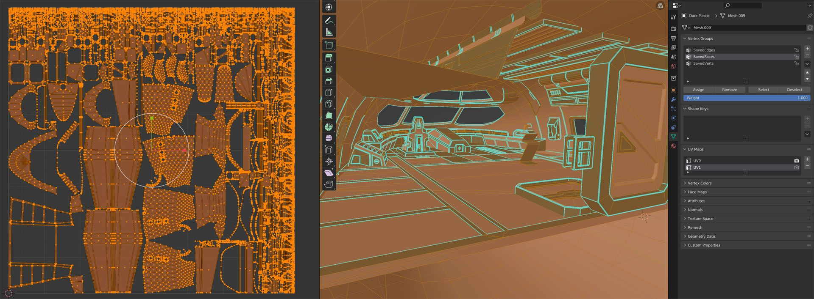If your UVs don't overlap at all, you can sometimes use them as the lightmap UVs.

💡

You can use the lightmap unwrap option or the smart unwrap. The former I've found does a decent job on blocky objects and objects made out of mostly quads, but falls flat for any triangular objects and cylindrical ones. For these and other organic shapes, smart unwrap or manual unwrapping is a better option.

---

### Step Three: Material Setup

Alright alright alright! So now you have your objects unwrapped and any objects that share a lightmap are also sharing the same UV1 channel.

Next we have to set up the materials.

**1) Select an object with the material you want to add a lightmap to, then go into the Shading view tab.**
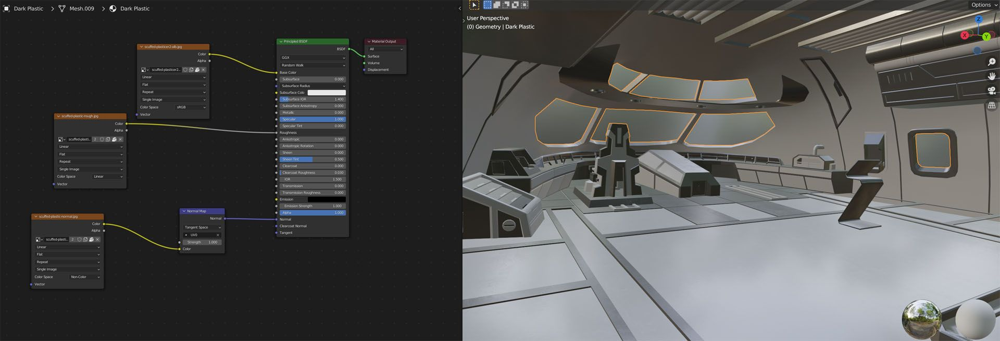Blender's Shader Editor is where we'll put an Image Texture node as a target for our light bake.
**2) Add an Image Texture node and create a new image. **`512 x 512`, `1024 x 1024` or `2048 x 2048` are good sizes depending on how much detail you need. Unless you are doing the IBL pipeline, it does not have to be 32 bit.
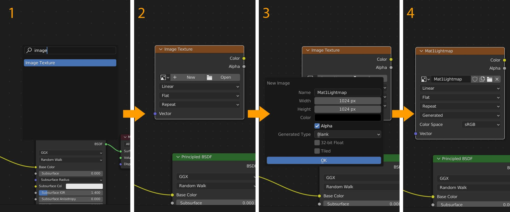The steps needed for creating a new Image Texture.
**3) Add a UV Map node and set it to your second UV channel. Add a Mozilla Lightmap Node. Wire them both up. Leave the MOZ Lightmap Node set to 1 (unless you're doing the [IBL](https://en.wikipedia.org/wiki/Image-based_lighting) workflow, which is not covered here).**
The nodes needed for exporting a lightmap texture with your object(s).
**4) Repeat these steps for any other materials that are going to be baked.**
There are two materials in this one mesh object that are going to use the same lightmap, so I copied the lightmap node setup to both materials.
You're now ready to bake!

---

### Step Four: Baking

Now that you have an image texture wired up to UV1 (which is an atlas map) we can start the baking process.

**1) Set your renderer to Cycles and choose your render settings. Set the 'Bake Type' to 'Diffuse' and uncheck 'Color'. **For render settings I typically use between 256-1024 samples. If you're using the "Noise Threshold" option then you can use the Denoise settings in the Render window. If you're using just a set number of samples, see Step Five for an alternative denoising method.
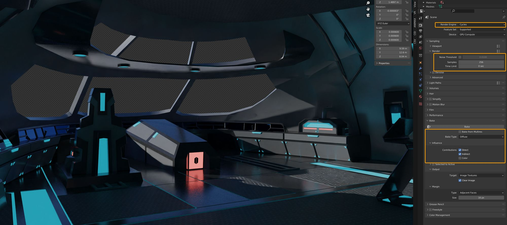
**2) Select each material that you will be baking. Click on the lightmap Image Texture node. This will tell Blender what you are baking to.** If you have an object with two or more materials and one of them doesn't have a lightmap, *make sure that no image map is selected, *otherwise the renderer will overwrite that image with a bad bake result.

💡

The baking process will work off of whatever was last selected - whether it's a UV map, image map, etc.

**3) Select the objects to bake. Go to the UV list and select the second UV channel. **

**If you have one material or one lightmap spread out across multiple objects, repeat this for all of them and then shift-click to add them all to the same selection.**
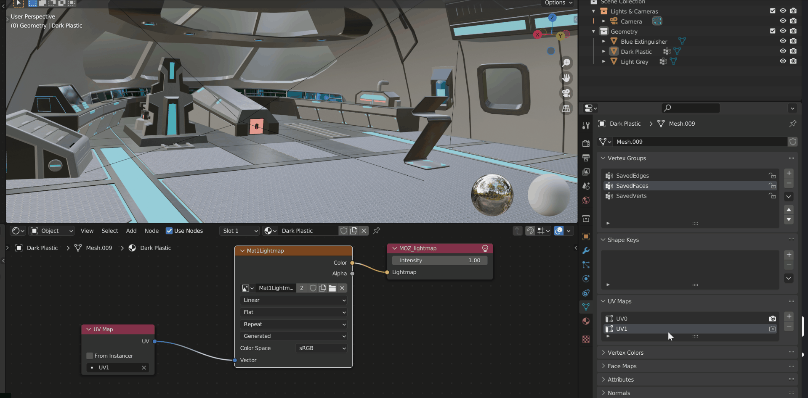
**4) Confirm you have done these steps:**

A) Set renderer to 'Cycles'.

B) Selected the lightmap Image Texture node inside each material that you are baking for.

C) Select the lightmap UV channel for each object you are baking with.

D) Select all the objects that share the material you are baking.

**5) Press 'Bake'. Open an image viewer window and set it to the lightmap to see the progress. Once it's done, save the image to disc.**

**6) Optional: To check your lightmap, drop it in the diffuse channel of your materials and view the mesh in Material mode.**
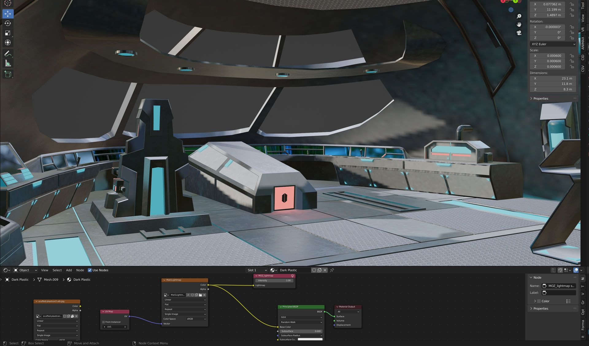

---

### Step Five: Denoise

Diffuse Baking is the easiest way to bake only the light information into an image. However, Denoise will not work on it, so we have to use the Compositor to do it.

**1) Go to the Compositor tab. Make sure that "Use Nodes" is checked on.**

**2) Add an Image Node to the compositor. Set it to the lightmap.**
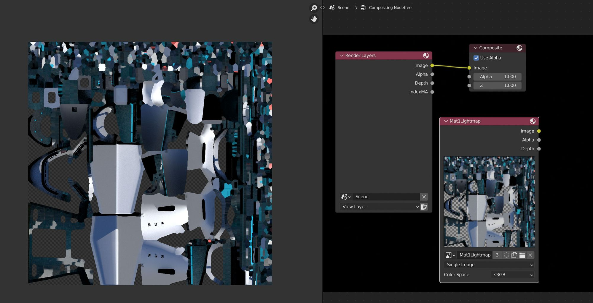
**3) Add a Denoise Node and a Viewer Node. Wire the lightmap Image to the Denoiser then to the Viewer Node. The denoised map will appear in the background of the Compositor.**
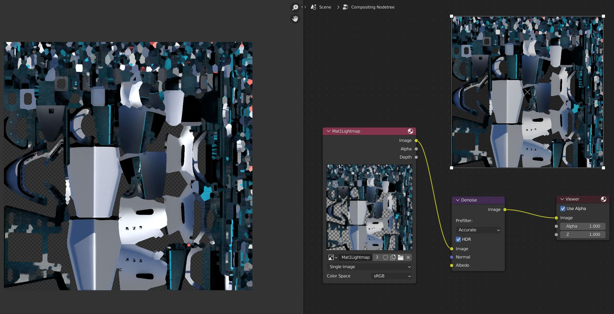
**4) Open an Image Viewer window. Set it to "Viewer Node" and then save the denoised lightmap, overwriting the old one. You may need to refresh the lightmap image in your Blender file to see the change.**
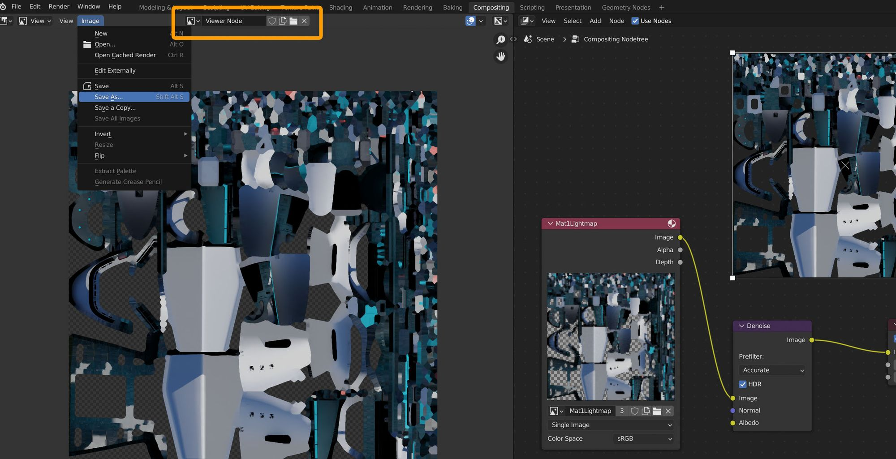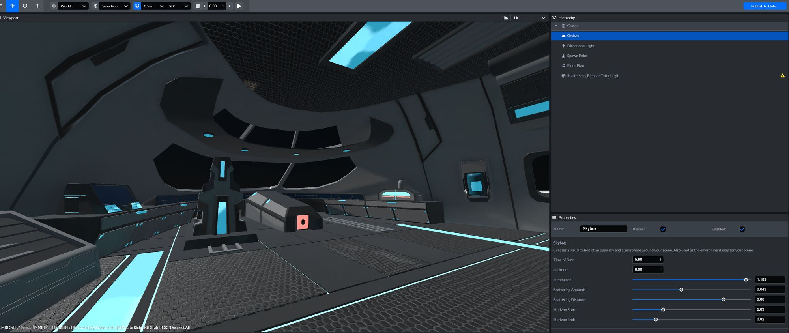

---

### BONUS: Increasing Contrast

Just adding the lightmap usually doesn't get dark enough darks. One way you can boost them is to also wire the lightmap into the GLTF Ambient Occlusion node. This node is not included in Blender by default so we have to create it.

**1) Create an Ambient Occlusion node. We will delete this later but it's good to start from because it has good inputs and outputs.**

**2) Group the AO node by selecting it and pressing Ctrl-G.**

**3) Delete the Ambient Occlusion node from inside the Group.**

**4) Go to the n-Panel and delete all the Outputs and Inputs except for the Color Input (yellow Circle). Rename the Color Input to Occlusion.**
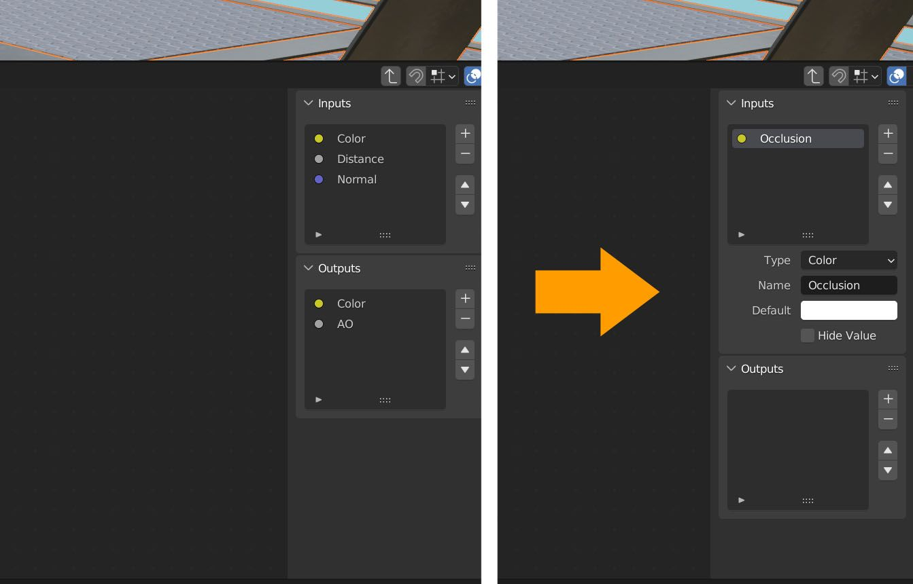
**5) Back out of the Group by double clicking anywhere in empty space.**

**6) Rename the Group to GLTF Settings (exactly this) and wire it up to your lightmap.**

**7) Re-export to Hubs to see the difference!**
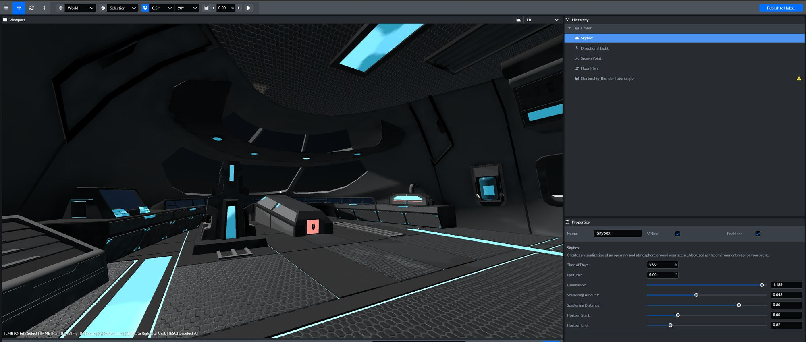

---

### You're done!

That's all there is to it, but if you have any questions please don't hesitate to reach out!
