Mozilla Hubs is capable of rendering highly realistic scenes, but it can also render stylized ones, and pixelated retro worlds are no exception. There is something charming about 3D worlds made from retro pixel art. From my experience, the nostalgic appearance of these worlds can trigger incredibly powerful emotions in people! Nostalgia is a powerful attention grabber that should not be underestimated.

Sprite-based worlds also have the benefit of being extremely performance-friendly, so it's a great way to create a world that you can show off to anyone on almost any device - even a low-end mobile phone.

In this tutorial, I’m going to show you how to to create a 3D world in [Blender](https://www.blender.org/download/) using 2D pixel art exclusively as our textures, with tips and tricks shown throughout the tutorial to optimize the scene for our target platform, Mozilla Hubs. Then I'll show you how to get it up and running for the whole world to visit on the web!

🎮

Click [here](https://hubs.mozilla.com/RGT3ioo/sprite-world-tutorial-demo) to test out a live demo of the scene we'll be creating!

---

## Art Sources

For the purpose of this tutorial, I will be using public-domain pixel art from [OpenGameArt.org](https://opengameart.org/). There are other places where you can source pixel art from – Google can help you there. As a side note, I will be referring to pixel art interchangeably as “sprites” or “spritework” throughout this tutorial.

Wherever you get your sprites, there are certain guidelines to keep in mind when picking the source:

- Sprites that were drawn for a _top-down camera view_ are generally ideal. ie. RPGs where you see the character/scene from above, in an overhead angle.
- Sprites drawn with an _isometric_ view are generally much harder to adapt into 3D as-is, and I strongly recommend against them for a beginner.
- Sprites drawn for 2D side-scrolling gameplay, meaning that you can only see the front of the object, can be usable but will require extra work/creativity on your part to adapt to 3D since you only have one view to start with - the front view.
- Sprites with a lower resolution (ie. 8-bit) are the easiest and strongly recommended for your first attempt.

---

## Tools

For this tutorial, I am going to be using the newest version (at the time of writing this) of the following tools, all open source.

- **GIMP 2.10.32** (image editor) – [https://www.gimp.org/](https://www.gimp.org/)
- **Blender 3.4** (3D modeling suite) – [https://www.blender.org/](https://www.blender.org/)
- **Mozilla Hubs** / **Spoke** (VR platform) - [https://hubs.mozilla.com/spoke/](https://hubs.mozilla.com/spoke/)

I will keep the image editing instructions general enough so that you can follow *most *of the same steps in any other image editor that you may prefer. GIMP just happens to be available on every major desktop OS and 100% free, so anyone can use it. Although GIMP has a complex interface, we’re only going to use a tiny subset of its features, so you can safely ignore most of its interface without feeling overwhelmed. There isa part of this tutorial, towards the end, that can *only *be done in GIMP, so I recommend you install GIMP even if you follow most of the tutorial using an alternative program.

I always use the latest version of Blender, which at the time of writing this, is 3.4. However, you can probably follow the same instructions on earlier versions, at least since 3.0. There may just be slight differences in the UI that you'll have to deal with.

For Blender, I’ll also be using the [Hubs Exporter addon](https://github.com/MozillaReality/hubs-blender-exporter), which makes publishing of Blender scenes in Hubs much easier (in my humble opinion!). You are expected to have this addon installed for this tutorial. You can download the addon separately using the link below.

[https://github.com/MozillaReality/hubs-blender-exporter](https://github.com/MozillaReality/hubs-blender-exporter)

For this tutorial, you will also be expected to have at least a basic understanding of the latest Blender’s interface and tools. You should already know how to move, rotate, and scale objects, how to assign materials and textures, and how to work with collections. There are [many tutorials](https://www.youtube.com/results?search_query=blender+basics) on YouTube that can get you up to speed on the very basics.

---

## Create a Project Folder

This is how I recommend you structure your project folder. You’ll be storing all your textures in the *textures *folder, and exporting models for Hubs to the *export *folder. I also often create a "ref" folder for storing visual references for the scene I'm planning to create.

---

## Preparing Your First Spritesheet

Our first task is to create a sprite sheet that will contain most, if not all, of the 2D tiles for your scene. A sprite sheet is basically an image that has many sprites laid out in a large grid. What I typically do is use one spritesheet for each area; for example, one sprite sheet exclusively for outdoor tiles, another for indoor areas, and another for characters. You can also just combine them all into a single one, but you’ll need to increase the image size accordingly if so.

Typically, you can usually go with an image size of 256 x 256 or 512 x 512 for your sprite sheet, or perhaps even smaller, depending on the complexity of your scene.

💡

Note: If you obtain your sprites from the web, the sprites will often already be in a convenient grid format already, and you won’t need to create a sprite sheet yourself from scratch. However, sprite sheets from the web do not always come in standard “power of 2” sizes - 128x128, 256x256, 512x512, or 1024x1024.

It’s good practice to stick to dimensions that are a power of 2, so you may need to resize the image even if it's already in a grid format.

The Field of the Floating Islands, by Buch
I’m going to be using [this tileset](https://opengameart.org/content/the-field-of-the-floating-islands), created and published by [Buch](http://blog-buch.rhcloud.com/) under a CC0 public domain license. The image above depicts what the final scene will resemble after all our tiles are arranged in the right positions. Download the file named *tiles_packed.png *on that page and place it in your *textures *folder.

This sprite sheet is already in a convenient grid format, but without ideal image dimensions (368 x 128). Let’s resize it in GIMP real quick to 512 x 128 to keep the dimensions in powers of 2. Open the PNG in GIMP, and in the top menu bar, go into **Image**→ **Canvas Size**...

Set the width to 512 as shown above. Then press Resize. Now do **File**→ **Overwrite tiles_packed.png **in the top menu bar. You’ll notice that a bunch of empty space was created in the image. That’s okay – you can use the extra space to fit in extra sprites/tiles if you wish, but you can also just leave it blank. That extra space won’t really make any notable difference in performance or file size. The image is still really small anyway!

So we now have a sprite sheet that is ready to use. So let’s open up Blender!

---

## Setting Up Your Blender Scene

You can either create an entirely new Blender file yourself, or you can use the template I've made available for download below:

[

Download Template for Blender 3.4

Template.blend

780 KB

.a{fill:none;stroke:currentColor;stroke-linecap:round;stroke-linejoin:round;stroke-width:1.5px;}download-circle
](**GHOST_URL**/content/files/2022/12/Template.blend)
This project template already has the UI set up with the correct layout that you'll need for this tutorial. If you have your own preferred Blender layout, you don't need to use mine, but you'll at minimum need to have a 3D viewport, shader editor, and image editor in your layout somewhere.
Delete the default cube and create a Plane (Shift+A → Mesh → Plane). By default, this plane will have dimensions of 2 x 2 Blender units. In the right-hand sidebar (N), in the Item tab, you’ll see the Dimensions listed, as seen below:

To ensure that all of the sprites in the scene maintain correct relative proportions to each other, we’re going to be using the scale of 1 Blender unit = 1 sprite pixel. Later on, we’ll resize the entire scene so that it’s in the proper dimensions for Hubs, but for now, stick to these proportions. The sprite sheet we resized earlier has dimensions of 512 x 128, so we’re going to resize the dimensions of this 3D plane to X=512, Y=128.

Create a material called “**tiles**”on this plane, and add an Image Texture node with the tiles_packed.png we resized earlier. Set it up so it looks like the setup below:

Note the following settings:

💡

You should set “Alpha Clip” on the material settings on the right. We’re going to set this back to Opaque later on, but for now, it’ll make the next task easier to do.

💡

Set the “**Closest**” setting in the Image Texture node– this is important to prevent blurriness and pixel bleeding/clipping. You'll almost *never *use this setting when creating other kinds of scenes for Hubs, but in sprite-based worlds, this is an absolute must.

💡

Turn on **Backface Culling** in the material properties on the right. This lets you see if any faces have incorrect normals. In simple terms, if you see any face that looks invisible when it shouldn’t be, Backface Culling will make that obvious – and you can then fix it in Edit Mode, by highlighting the face, and doing Alt + N → Flip.

💡

Although technically not required, I recommend setting **Roughness **to 1.0 in the Principled BSDF node. This minimizes any visible "shininess", which generally looks terrible on simple, low-poly geometry as well as sprite-based models.

---

## Cutting Up Your Sprites

The next task is going into Edit Mode (Tab) and using the **Knife **tool (K) to cut up the plane, so we can get the individual sprites out of it. As you make cuts, you can extract each individual sprite using the Y key and then move it out of the main plane, as shown below:

Do this until you’ve completed the whole set or at least the ones that you know you'll actually use. Yes, this might take a while! It’s one of the most time-consuming parts of this process. You’ll need to zoom in on the pixel to make sure you’re cutting exactly at the ends of each pixel. In some cases, this process can be made faster by also utilizing **Loop Cuts** (Ctrl+R while hovering your cursor near an edge, then mousewheel up), as shown below:
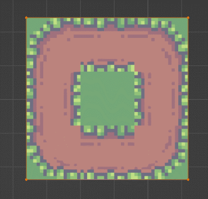Instead of manually cutting this set of sprites with the Knife tool, use Loop Cuts to quickly create perfectly symmetrical cuts automatically in the right spots.

---

## Perfecting Your Cuts

During this cutting process, you'll probably notice that the Knife tool can be quite unpredictable, and it often creates cuts in places you weren't even trying to. You can usually fix this after it happens, by hitting X and choosing **Dissolve Faces**, while the faces with unnecessary cuts are highlighted in Edit mode.

If you mess up and are slightly off in your _intentional_ Knife cuts, don’t worry! You can correct your own cuts easily by enabling “Correct Face Attributes” in the lower right Options menu, as shown below:

**Correct Face Attributes** makes it so that you can move edges around without actually changing the appearance of the plane. See below for a demonstration:
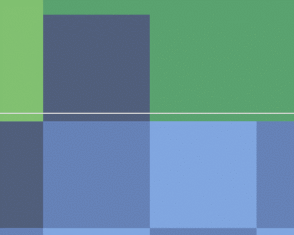An edge being moved, yet the texture appears unchanged. "Correct Face Attributes" makes this possible.

⚠️

Make sure you **disable Correct Face Attributes **when you no longer need it! If you don't, it will ruin your sprites as you start to move them around later on, and the worst part is, you might not even notice it until it's too late to undo. I say that from experience. 😉

---

## Removing Transparency

Later on, we’ll be baking all of the light in the scene. However, baking the light on objects with transparency can lead to _very_ ugly lighting artifacts.

Because of this, I strongly recommend cutting up your sprites so that any **transparent **parts are completely removed. One way to achieve this quickly is by using Loop Cuts (again, Ctrl + R while hovering the cursor over the sprite, then mousewheel up) to create a pixel grid on the sprite. Then highlight the transparent pixels and delete them. See the GIF below for a demonstration:
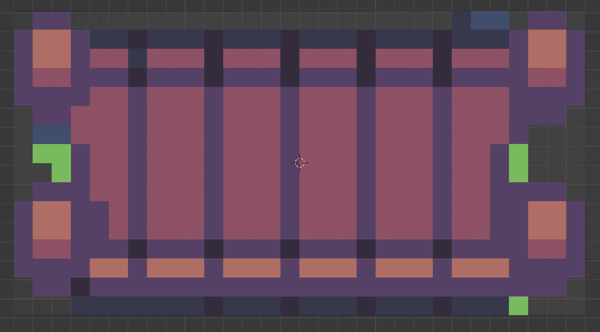

💡

Loop Cuts will not work as expected if there are extra, unnecessary vertices on the sprite. If you ever run into this problem, highlight the whole sprite in Edit Mode, then press X, and choose **Limited Dissolve**. This usually removes any unnecessary vertices, and Loop Cuts should then work.

After deleting the transparent parts, you can remove the pixel grid we just created by highlighting the entire sprite in Edit Mode, and then press X → Limited Dissolve on it again. That grid was drastically increasing the polygon count of the sprite, and we don’t need it anymore, so it’s good practice to get rid of it to maximize performance.

After completely removing all transparent parts from all of your sprites, you can also then remove any Alpha settings from your material, which will also help with the performance of your scene. Set the following back to Opaque, for both Blend Mode and Shadow Mode:

---

## Structure Building

Once you’re done cutting everything up, highlight all of the faces in Edit Mode, press P to open the Separate menu, and choose “**By Loose Parts**.” This will separate all of your sprites into separate objects, which you can then duplicate individually as many times as you need to create the structure of your scene.

We now have all our sprites as individual objects, ready for use, as shown above. Notice that I already went ahead and rotated some parts of these sprites to make them have actual 3D depth, such as the terrain on the left, and the stairs on the center-left.

⚠️

**About those stairs though...**
Look closely at the staircase sprite above. Try to imagine how you’d turn this into 3D. Notice anything weird? In 2D, the stairs look fine, but the moment you start recreating this in 3D, you’ll immediately notice how problematic this sprite actually is. Assuming that the walls next to the stairs are 100% vertical, the stairs would be perfectly vertical too, and wouldn't make any sense in 3D as is.

You’ll encounter this often when working with videogame pixel art. Many staircase sprites are drawn this way. For that reason, you’ll often have to get creative and *extend *the length of the 3D stairs beyond the original length of the 2D stairs. Otherwise, visitors won’t even be able to walk up the stairs!

**Back to where we were**: You can now start tiling all of the pieces together to create the base structure of your scene. There are two features in Blender that make this part *significantly *easier:

**Snapping **– This allows you to automatically snap pieces of geometry to each other, based on their edges, faces, or vertices. There are many [tutorials](https://www.youtube.com/results?search_query=blender+snapping) on the snapping system out there if you’re not already familiar with it. With snapping, you can *very quickly *build a terrain using the modular pieces we've prepared, as long as the edges/vertices on the pieces are close enough.
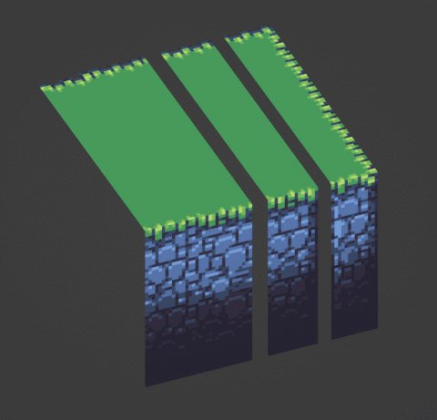

⚠️

Note that just because the pieces are touching each other after snapping, it doesn't mean they're actually connected as one piece. They're still technically two separate, floating pieces of geometry. We can fix that quickly:

1. Join the separate sprites into one object by highlighting both in Object Mode and hitting Ctrl+J.

2. In Edit mode, highlight both/all faces, press M to open the **Merge** menu, then choose **By Distance**. This merges any adjacent edges/vertices together so that there are no "doubles." (Trivia: This tool actually used to be called "Remove Doubles" in older Blender versions!)

**Array Modifier – **Very often, you’ll encounter a sprite that is supposed to repeat over and over, in many rows or columns. You can use Blender’s [Array modifier](https://www.youtube.com/watch?v=g3DFxH0N7U0) to achieve this quickly without having to manually tile the sprite yourself. You can even use the Array modifier to tile an entire 3D structure of sprites, as shown below.

This can save an *enormous *amount of time. If you use it, note the following:

- Make sure you tick the **Merge** checkbox in the Array modifier so that the new copies are all connected.
- The Array modifier might produce unexpected results if there are temporary transformations (ie. rotation, scale, translation) on the model. If this happens for you, hit Ctrl+A and choose **All Transforms** and it might fix that.

## 

## Guidelines for Animated Sprites

Because animation is a huge complex topic all by itself, we won’t be going into a detailed step-by-step on how to animate sprites in this tutorial. However, here are a few quick notes that I will mention.

Do **not** store animated sprites in the same file that you’re using for the static sprites. Animated sprites must be laid out in a flipbook format, which your main tileset usually won’t and often can't have. In addition, animated sprites nearly always have transparency, and our main tileset will have alpha rendering disabled. As a general rule, keep all of the following categories in their own separate image files - do **not **mix and match these:

1. animated sprites with alpha (ie. most animated sprites)
2. animated sprites
3. static sprites with alpha
4. static sprites

This allows us to selectively enable alpha rendering only on *specific *parts of the scene, not on the biggest parts. That's better for performance and also prevents ugly light artifacts on the static parts of your scene, later on when we bake light.

💡

There are two main types of alpha rendering in Blender and Hubs:

1. **Alpha Clip**
   renders pixels either 100% transparent, or 100% opaque

2. **Alpha Blend**
   renders pixels in a range between 0% to 100% transparent/opaque.

You should stick to Alpha Clip as much as possible.

You'll *rarely *ever need Alpha Blend in sprite-based worlds. There are only a few situations where you might. For example, creating fake light rays emanating from windows. Or when you want to add "fades" to passageways or doorways, so that they fade to black. For both of these scenarios, you can use a transparent gradient texture that fades to 0%, or [vertex color alpha](__GHOST_URL__/fading-assets-gracefully/).

Alpha Blend does come with a significantly higher performance hit than Clip, and also can create rendering glitches when there's overlapping between transparent objects. So use it only sparingly.

To maximize performance even further, if you have many different animated sprites, you can combine them all into one single sprite sheet, if they happen to have the same frame count. Here’s a visual example of what I mean:
Note: The black borders are for demonstration purposes here only, to make it obvious that these are 16 frames in one image. Do not actually add these black borders on your own sprite sheet!
Pictured are 4 different animated circles. They all have 4 animated frames (going across horizontally), so they all fit neatly into a single square-shaped texture. You can use a single sprite sheet like this to add, for example, dozens of different animated NPCs to your scene, using only a single image file! It’s great for performance, and also saves you from having to create separate materials for every single NPC.

---

## Organizing the Scene

After you finish tiling your sprites, you should end up with something roughly like the following:

It's okay if yours doesn't look exactly like the original reference. Remember that you are creating your own adaptation - in 3D and for VR. That inherently means there will be differences from the source material.

Since we are creating a scene specifically for Hubs, which can host dozens of people at a time in a single room, you'll also want to keep that in mind when structuring the size of the scene. If the original source material was too small to hold this many people, it's okay to expand on it and add extra walkable areas.

Now that we have a base structure completed, we can start to add props, like trees and rocks. However, just before we do, let's do some cleanup first in the Blender project itself, to keep things organized and easier to export later on. We use the Outliner for that - usually located at the very top right of the Blender window, where all your objects and collections are listed.

Organize your scene so that it's organized as above. We want to have everything that we want to export in one big "_export_" parent collection. Add a subcollection inside it that will contain our lights (for a daytime outdoor scene though, a single Sun light is often enough), and another subcollection for static structures/terrain. We'll also need a subcollection for any sprites that aren't base terrain/structures, such as rocks or trees, as pictured above.

Outside of the export collection, create another collection named "modular" and add to it all of the modular sprite pieces that we created and cut up very early on in the tutorial. We still need some of these to place our remaining props (ie. rocks, trees) into the scene, but we don't necessarily want the raw modular pieces of terrain exported with our scene to Hubs, so let's keep them separate. That makes it easy to exclude them at export time.

As for our completed models themselves, my recommendation is to have one object for _terrain_, one for manmade _structures_ (like the stairs and bridges), and one for any bodies of water (if there are a lot of them). This lets you selectively hide/show different parts if you ever need to. Ultimately, when we export the scene later, everything will be exported together even if they're in separate objects.
When we export to Hubs later, only the stuff under the "export" collection will be exported because we'll disable the "modular" collection once we no longer need it.

---

## Placing Props

Start plucking props from the "modular" collection, such as rocks and trees, and place them onto your base terrain. As you do this, there are a few things you want to do every single time for the sprites you move over:

- Move each sprite object (with the M hotkey) to the "sprites" subcollection we created earlier.
- After positioning, with the sprite still selected, hit Ctrl+A → **Rotation & Scale**
- Set the **origin point** of each sprite to the bottom of the sprite. This is important, and you'll see why in a bit. See below:

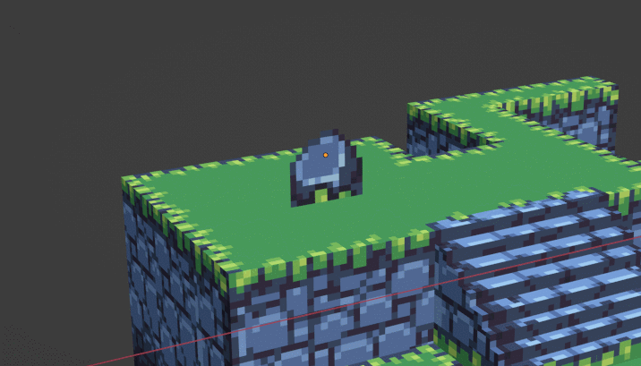
Snapping (via Face mode) can be used to position props onto the terrain in a more natural fashion:
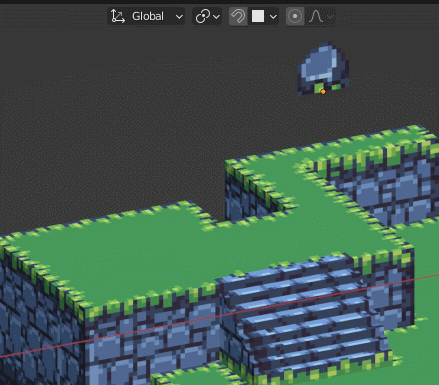With Snapping to Faces enabled, the rock sticks to the surface of the terrain as you drag the rock above it.
Notice how this rock above is completely flat, though? There are times when, due to the way the sprite was drawn, you may need to just leave the sprite flat like this. That's okay - because we're going to be setting it as a **billboard sprite**. Billboard sprites always automatically rotate to face the camera, creating the illusion that they're a real object present in the scene, even though they're technically just a flat picture! We're intentionally not going for realism in these kinds of projects, so using an illusion like that is totally okay here.
Blender's Object Properties tab, showing the Hubs "Billboard" component
To designate a sprite as a billboard sprite, highlight the sprite object and go into the Object Properties on the right side of the Blender window. In newest Blender versions, it's the tab with an orange square icon (see above). Assuming you successfully installed the Mozilla Hubs Blender addon at the beginning of the tutorial, you should see a Hubs subtab here, with a button titled "**Add Component**." Click it and select "**Billboard**." You won't see the billboard effect in Blender itself after you add this component - it only has an effect in Hubs.

Note that the tree's billboard sprite is uniquely large compared to every other sprite, and because of that, it should also have the "_Only Y_" checkbox enabled. When you have a particularly large object like a tree, the billboard effect just looks too fake without this setting enabled.

💡

Remember how I asked you to set the **origin point** to the bottom of the sprite earlier? The billboard effect is based on the origin point of the object! And we need the sprite to rotate **based on where it touches the ground**. Therefore, we should set the origin point to the bottom of the sprite.

---

## Repositioning and Resizing the Scene

Once you're done positioning all of your prop sprites, you should end up with something resembling the above. Notice that I've disabled the "modular" collection. We no longer need it, so untick the checkbox and disable it to ensure that it won't be exported when we export the whole scene to Hubs later.

During this whole time, we've had the entire scene positioned in an offset location from coordinate (0,0,0). We want to reposition it so that it's actually properly centered in the scene. An easy way to do this is to use the Numpad 1 and 3 keys to change the view in Blender to see the front and sides of the whole scene. Highlight everything using the A hotkey and then hit G to move everything until coordinate (0,0,0) is around the middle of the scene, but above ground, like so:

Now we need to also correct the size of the whole scene to one that works for Hubs' default avatar size. In the right sidebar of the 3D viewport (N key), in the **View** tab, you'll see settings for the 3D cursor's location. Change this to zero for all three, X, Y, and Z. This will move the 3D cursor to coordinate (0,0,0).

There's an extremely handy feature in Blender called **Walk Navigation**. By default, it's usually assigned to the hotkey **Shift + tilde**, which is usually under "Esc" on a keyboard. You can also find it in the 3D Viewport menu, View → Navigation → Walk Navigation. When you use it, it enables a first-person camera mode that lets you fly through the scene with the WASD keys (like in a first-person shooter) and preview it like a videogame. I use this constantly when I'm working in Blender. Note that you can increase/decrease the movement speed by moving the mouse scrollwheel up and down.

Walk Navigation can be used to gauge the scale of your scene for Hubs, thanks to its gravity feature. Press the G key while Walk Navigation mode is enabled, and you will be dropped down to any ground immediately beneath you, allowing you to walk on the ground. As soon as you land, look around and walk around to see if the scene is too big. The scene will likely look massive the first time you try this, as when I did it, the tiny mushroom sprites were several times taller than the height of my eye level. Hubs's default eye level isn't 100% identical to Blender's, but it's very close, so it still gives us a good idea of where our scene is in terms of Hubs' scale.
View while in Walk Navigation mode, walking on the ground. The mushrooms look giant!
So let's resize! Exit Walk Navigation mode by simply clicking anywhere, or pressing Esc.

We first need to set our pivot point to the 3D cursor that we set to (0,0,0) earlier. Hit the period (.) key and select 3D Cursor, as shown below. This will ensure that when we resize the whole scene, it all stays still centered around the center point, (0,0,0).

Now highlight _everything_ in your scene using the "A" hotkey. Press S to begin using the scale tool, then type .5 on your keyboard to shrink it by half. You'll usually need to do some trial and error and keep trying different numbers, while repeatedly entering Walk Navigation mode to test the scale each time. For this particular scene, I was able to resize to something reasonable by using a scale of .125, but this will vary for every scene.

---

## Applying Transforms

There will be many times in Blender when you will accidentally move, scale, or rotate something, and you want to be able to quickly reset it to where it was supposed to be. We can make this possible by **applying transforms **on the objects in our scene so that their transforms (or at least most of them) become permanent. We already applied transforms previously in the tutorial with the Ctrl+A hotkey - now you know the reason for it!

For the static objects, which include terrain and other larger structures (like the bridges and the stairs), we want to highlight them, hit Ctrl+A, and select **All Transforms**.

For the billboard sprites though, special care is needed. De-select everything first by double-tapping the A key. Then select only your billboard sprites (easy to do if you've kept them all in one collection). Then make sure that the sprites are all facing forward, meaning that when you press Numpad 1 in the 3D viewport, they're all facing you head-on, with no weird rotations on them.

Now, hit Ctrl+A, but this time, we actually only want to apply the Rotation & Scale. **Do NOT apply Location** on your billboard sprites! As noted earlier in the tutorial, the billboard effect is dependent on each sprite's origin point. Applying the Location transform on them will alter their origin point, which would ruin their billboard effect.

If you applied transforms correctly, you should now be able to resize or rotate any of your 3D objects, and then reset their scale/rotation back to normal by hitting Alt+S (scale) or Alt+R (rotation). For the terrain and other large static structures, you can also reset their position with Alt + G if you accidentally move them.

---

## Skybox Rendering

We've had a boring grey backdrop around our scene this entire time. It's time to finally pretty it up, by creating a skybox. How you come up with a skybox is largely a matter of preference and will vary per scene. For this specific tutorial, we're going to go with a simple, no-frills, gradient sky.

Gradient skies can be generated in Blender itself very easily. Create a new, separate Blender file and save it as "Skybox.blend" inside the same folder. You can use the Blender Template I provided in the beginning of the tutorial, or you can just create your own. Whatever you go with, set up the UI so that you have the 3D Viewport and the Shader Editor both visible. The Image Editor won't be needed until the end. You can go with a setup like this:

First, delete the default cube. There should be nothing in your scene except for a lone Camera object. Now select the **Camera **object. Hit Alt + G, followed by Alt + R to reset its location and rotation. It will now be in the dead center of the scene (0,0,0) and will be rotated to face straight downward. We want to rotate it on the X axis by 90 degrees, so hit the following keys: R, X, then type in the number 90.
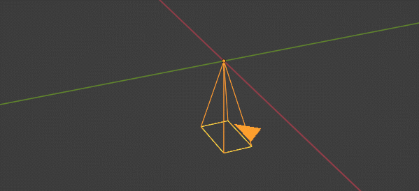The camera will be facing straight forward, the direction we need for skybox rendering.
Go into the Output Properties on the right of the Blender window.

Adjust your settings so that they reflect the above. Normally, skyboxes are extremely large images, but for a gradient skybox, you can get away with something relatively small, like 1024 x 512 here. Just make sure the width is twice the height. This is what we call **equirectangular** format.

Now let's tell the Camera object to also render in a panoramic, equirectangular format.  At the time of writing this, only the Cycles rendering engine in Blender supports this. Eevee does not (yet!) So make sure you set Blender to use Cycles, like so:

Go into the Camera Properties tab now. Change the settings to the following:

Just one more set of settings we have to change, this time on the Render Properties tab (it's the first one). Change yours so they look like this:
Make sure denoising is off. It can add ugly rendering artifacts to the skybox, and since we have an empty scene, we won't need it anyway. You can probably get away with even lowering the Samples count as well. Note that the GPU Compute setting is optional.
Now let's set up the World material that actually tells Blender what gradient to use. As you're doing this, you can actually keep a live preview of the skybox in the 3D viewport by pressing the Numpad 0 key and going into Rendered mode with the Z key. Setup your material like in this example below, via the Shader Editor.

No textures are needed for this to work. You can find all of these nodes, by the way, using the Shift + A shortcut in the Shader Editor and then typing part of the node name.

You are welcome to use your own gradient colors. You can get ideas for some by googling "sky gradients." However, do note that there is one color that should be left the same as in my example, and that's the darkest color you see, on the farthest left of the ColorRamp.

This happens to also be the **exact **color (Hex code #292634) that is visible at the bottom of our platforms:

Toward the end of the tutorial, we're going to be making these platforms look like they're fading into the abyss below, and we can only do that if the bottom color is identical to the one in the bottom of the skybox. So that's why you see this color in the ColorRamp node.

Once you've set up the shader nodes correctly, you can go ahead and hit F12 to render the skybox. Blender will pop up a new window with the rendered image. It should be an almost instant render. Blender isn't going to save this new image automatically. Go into the menu of the window, in **Image →\*\***Save a Copy\*\*, and save the image to the textures folder as "skybox.png".

To actually use it in our Sprite World, reopen your Blender file for the Sprite World scene, go into the Shader Editor (set to World mode, not Object mode), and modify the existing World material by adding an **Environment Texture** node.

You should immediately see it in effect in the 3D viewport while in Rendered mode (Z hotkey).

Keep in mind though, that this affects the skybox appearance *only *in Blender. It does absolutely nothing for Hubs. If you exported the scene right now, Hubs still wouldn't have a clue that this is supposed to be the skybox. To also set up the skybox for Hubs, we need a few extra steps.

In the Scene Properties tab, look for the Hubs section, and click the Add Component button. Add an **Environment Settings** component like below:
Set the skybox.png that we just created, as the "**Background Image**" and "**EnvMap**" in this new component. Set **Tone Mapping** to None. Leave Background Color as white.

---

## Adding a Pixel Sun

We're not quite done with the sky yet. Although we have Sunlight in the scene, it doesn't actually create a visual representation of the sun in the sky. All it does is cast light.

Remember that empty space we had in our tiles_packed.png? It's perfect for little extras like this. We can draw a simple sun in there. Open the PNG in GIMP and find an empty area. You can use the **Ellipse Select** tool (Tools **→** Selection Tools **→** Ellipse Select) to create a circle-shaped selection while holding the Ctrl and Shift keys, and then use the **Bucket Fill** tool (Tools **→** Paint Tools **→** Bucket Fill) to fill it in with a yellowish color. Here's how mine turned out, in the lower right:

Create a plane in the Blender scene with the dimensions of 512 x 128, just like when we first began. Assign it the "tiles" material we've already been using. However, we want the sun to be emissive, unlike the rest of the scene, so we actually shouldn't use the same material, even though it'll use the same texture. Duplicate the material by clicking the 📄 button right next to the ✖ button (see below). Name the new material "sun" and set its settings like this:
Shadow Mode should be "None" for this material. The Sun sprite should **not **be casting any shadow whatsoever, for any reason.
Now modify the nodes of the new "sun" material, like below:
Note the Base Color - it should be black, with nothing plugged into it. You'll also unplug the Alpha connector once you're done cutting up the sprite with the Knife tool.
Use the Knife tool (K) to cut out the sun sprite from the spritesheet, and delete the leftovers. Then follow the same process we used earlier for all the other tiles. For example, create a grid on the plane using Loop Cuts, remove the transparent parts, etc.

Once you're completely done using the Knife tool, clear ALL transparency settings in the sun material, ie. change Alpha Clip to Opaque, remove the Alpha connector from the Principled BSDF node, etc. Rename the sun object to "sprite_sun" and place it in the "sprites" subcollection.

Then use the Rotate (R) and Move (G) tools to position the sun far off in the distance. Here's where I recommend placing it:
The sun sprite should be very far away, but also scaled up enough so that you can still see it. When you walk around in Walk Navigation mode (Shift + ~), the sun should *not *visibly move on your screen.
There's still plenty of room in the tiles_packed.png, so if you wanted to, you could go even further and draw sprites for clouds, a moon, stars, etc. (leaving the possibility of a night time version of the scene in the future 🌝). That's up to you.

---

## Concepts of Lightmapping

We've reached the most advanced part of the tutorial, so it's important to go over a few concepts first.

To sum it up, **light baking **(or "light mapping") is the process of pre-rendering the lighting/shadow data in the scene, allowing you to save all of the lighting to a file - what we call a lightmap. You can then add this *prerendered *lightmap to your 3D scene's materials, to add performance-friendly, high-quality realistic lighting to the scene. Rendering photorealistic 3D light *in real-time *is normally a very intensive process, requiring lots of processing power. However, by saving the light to a lightmap, you allow the 3D renderer to skip that intense rendering process, by instead loading the lighting from a pre-rendered image file.

Technically, you aren't required to bake light for your scene. You can actually leave the whole scene with zero lights or lighting, and then Hubs will render it fullbright / unlit when exported via the Blender Hubs exporter addon. For sprite-based worlds, this can actually look okay - in fact, it might even look more authentically retro! However, from my experience, baking Blender light into your scene can really make it feel much more immersive, adding much more of a sense of "place." In my opinion, the extra work is absolutely worth it. Due to the simplicity of this tutorial scene, that might not be immediately obvious - but as you create other scenes in the future, with more complex shapes and lighting setups, you'll see what I mean!

One critically important concept to understand for lightmapping is **high-dynamic range**, or HDR. Common image formats, like PNG, store data in 8-bit format, between values of 0.0 to 1.0, with zero being the absence of any light (pitch black), and one being the complete absence of shadow (pitch white). However, .HDR images can store values _above_ 1.0, creating a bloom effect. When you have light in your Blender scene that is making textures brighter than they originally were, you are actually creating light values above 1.0!
In the upper image, the extremely bright Point Light is creating light values far above 1.0. In the lower image, only light values of 1.0 are being rendered, meaning that the original grass texture is never made brighter than it originally was.
When we bake light, we don't want to bake to a PNG, because that format can't store values above 1.0. Highlighted areas with **bloom**, like in the screenshot above, would be completely lost. Thankfully, the .HDR format can store values above 1.0 in 32-bit format, and the latest versions of Blender, GIMP, and Hubs all have full support for .HDR images. So that's what we're going to use!

---

## Lightmapping Setup

First off, make sure you're in Cycles mode, not Eevee, because, at the time of writing this, only Cycles can bake light to an image file. If you downloaded my Blender template in the beginning, you'll already have a basic Sun light in the scene. If you don't, add a new Sun light with the settings below, and rotate it so that it matches the direction of the sun sprite we created earlier. The position of the Sun light doesn't matter and won't change how it casts light, but for the sake of making it easy to find, place it near the center of the scene.

We want to temporarily disable all of our billboard sprites (and anything else animated or dynamic) before baking. Why? As billboard sprites rotate to face you, any shadow you had baked for them instantly becomes inaccurate, making it pointless to bake the shadows they cast. So disable the "sprites" subcollection in the Outliner.
The sprites subcollection is disabled and won't be rendered.
To make things easier, let's combine the "terrain" and "structures" into one object. Select the bridge objects first, then the terrain (in that order), and then hit Ctrl + J while hovering your mouse in the 3D viewport.

Select the newly combined "terrain" object, and create a second UV Map for it named "lightmap" in the Object Data Properties, like below:

We also want to create a new image in which we'll temporarily store our lightmap. In Blender's Image Editor, hit the New button, and set it up like below before pressing OK:

You'll then see a pitch-black image created. Go into the Image tab and set "Color Space" to **Linear**. Lightmap images should *always *be set to this.

Now back to the 3D Viewport. With "terrain" still selected, apply all transforms one additional time (Ctrl + A → All Transforms). This helps prevent warped UVs.

Now hit Tab to go into Edit mode, and follow these steps:

- Tap the **A** key to highlight all faces of the 3D model.
- Hit **Ctrl + T** to triangulate every face
- In the 3D Viewport, press the **U** key and select "**Smart UV Project**"
- You should see a newly generated UV Map in the Image Editor.

UV maps generated automatically by Blender's tools are rarely ever ideal. You usually have to tweak them further. You'll need to do some trial and error, repeatedly, to figure out the best settings to use for the "Smart UV Project" tool. Here's what I settled on:
Using the settings on the lower left, the UV islands on the right all get a healthy amount of extra space around them, which is what we want.
One particular thing to watch out for is making sure that there's enough margin area around each UV island. Make sure all of your UV islands are far enough apart so that they have at least 5-10 pixels of space around them. Also, ensure that none of the UVs are overlapping (even within the same UV island)! Lightmap UVs should *never *be overlapping, not even by one pixel.

---

## Lightmap Baking

With our lightmap UVs all ready, there is just one final step before we actually bake. We need to tell Blender what file to bake to. Go back into the Shader Editor with the "tiles" material active. Modify it so it has the following setup:
The "light" Image Texture node should **not **be connected to anything.
After you're done, click on the Image Texture node titled "light" (the one on the far right.) This sets it as the "active" node, which tells Blender that it is the texture we want to use for baking. Yes, this is a very weird, not very intuitive way to set that, but that's just how Blender does it. 🤷‍♂️

Go into the Render Properties tab on the right side of Blender and adjust your settings like in the screenshot below. I highly recommend reorganizing the sub-tabs so that you see them in this order, as these are the ones most relevant for baking.
Max Samples under Sampling is a matter of preference - you can get away with as low as 200 or so because we're going to de-noise the result in GIMP anyway. But if you have a powerful rig or lots of time to spare, 500 or higher can help ensure a more quality render.
Once you've finished copying these settings, press the "Bake" button at the top. Blender will begin calculating the lighting for the 3D object you currently have selected, and then will save the lighting to the image file we had set as active in our 3D model's material. This could take some time, depending on the power of your hardware. If it takes too long, try lowering the "Max Samples" amount.

Once the lightmap is fully generated, it should appear in the Image Editor within Blender. Save it via the Image Editor menu, Image → Save a Copy...

⚠️

When you try to save the lightmap for the first time, **DO NOT **accidentally save as PNG first. Blender will often prompt you to save as PNG first. If you do so by accident, any light values above 1.0 will be lost, and you will probably need to rebake!

In the Save menu, on the righthand side, choose "**Radiance HDR**" as the format, as shown below. Make sure that "Save as Render" is disabled, and Color Space should be set to Linear. Save the .HDR file as "light.hdr" in the textures folder.

---

## Cleaning Your Lightmap

There are many people out there who unfortunately assume that open source projects aren't as "good" as the commercial alternatives, just because the open source options are usually free. GIMP is a key example of how untrue this assumption is, because it is the *only *image editor I know of that can effectively and easily denoise a 32-bit (HDR) image. Even some of the most popular commercial image editors struggle with HDR images. For that reason, GIMP is mandatory for this part of the tutorial.

Open your new "light.hdr" in GIMP. There are two filters that can be used to reduce noise in HDR lightmaps:

- Filters → Blur → **Selective Gaussian Blur**
- Filters → Enhance → **Noise Reduction**

These filters will become your best friends as you begin creating lightmaps. Both achieve noise reduction but in different ways. Some lightmaps will do better with one of these two than with the other. Experiment with both and see what gives you the best results on a case-by-case basis. For this particular tutorial scene, I found Noise Reduction did a decent job, though only by running it multiple times. Selective Gaussian Blur usually does the trick after only one run.

⚠️

You might notice that the edges around the UV islands might become blurred, resulting in visible color bleeding in your 3D scene. You can avoid this in 2 ways - 1) increase the **Margin Size** in your Bake settings, or 2) save the newly baked lightmap in Blender as an "EXR" image file, and edit *the EXR *in GIMP, not the HDR file.

Unlike HDR, EXR supports transparency, meaning that the UV islands will retain the transparent margins around them. The "Selective Gaussian Blur" filter in GIMP will respect these transparent margins, which then helps prevent color bleeding.

However, note that .**EXR is not currently supported by Hubs**. So you will need to save it again as an .HDR after you're done denoising the .EXR image in GIMP.

## Only the .EXR file on the right has transparency. The .HDR file does not. When you denoise, you might want to edit the EXR first, then export from GIMP to .HDR.

## Applying Your Lightmap

We've denoised our lightmap and made it ready for use. Select the terrain object in the 3D viewport in Blender. Then go into the Shader Editor and modify the "tiles" material like below:
This is a 100% export-ready shader setup for Hubs. The "MOZ_lightmap" node tells Hubs what lightmap to use. The "Background" node is more performance-friendly than the Principled BSDF node and works great for sprite-based scenes as long as you avoid anything with transparency.
However, note that this shader setup does *not *make your new lightmap appear in Blender. It only enables the lightmap for use in Hubs. To temporarily preview how your lightmap looks, use this shader setup below instead:
This shader setup will blend the lightmap onto your diffuse texture, making the lightmap actually visible in Blender's 3D viewport.Make sure you change it back to the previous node setup before exporting, though!
After setting it up as above, you should now see the lighting and shadows in your scene, even when you are in Material Preview mode (Z → Material Preview).

But what about our billboard sprites? We didn't bake light for those - but thankfully, we won't have to! We can actually reuse the lightmap we just made. Re-enable the "sprites" subcollection. As soon as you do, you'll notice that your billboard sprites will all be pitch black. They're still assigned to the same "tiles" material we're using for the baked terrain, but unlike the terrain, we never set up the billboard sprites with the correct lightmap UVs. Let's do that.

For each billboard sprite, do the following:

- Select the billboard sprite in the 3D viewport.
- Go into Edit mode (with Tab), highlight all faces with A, then press Ctrl + T
- Go back to Object Mode (with Tab)
- Create a new UV Map in the Object Data properties tab on the right side of Blender. Name the new UV Map: "lightmap"
- Check the UVs of the terrain immediately next to the billboard sprite. Adjust the billboard sprite's lightmap UV map so that it's roughly in the same position. If that sounds confusing, look below for a visual:

The billboard sprite, along with some of the ground terrain are both selected, showing both of their UVs on the right. The tree is essentially copying the light on the ground near it.
When you've finished doing this for every single billboard sprite, you should end up with something like this:

**Don't forget** to set the "tiles" material back to the [Hubs-friendly one](./content/images/2022/12/image-101.png). The temporary node setup that made the lightmap visible within Blender should _not_ be the one exported to Hubs.

---

## Fading Into the Void

Remember that special dark color we added to the bottom of our skybox? The intent was to make that color match the bottom of our 3D platforms so that they fade into the skybox. Baked light ruins this effect; see the screenshot above. The bottom colors no longer match the dark purple void in the skybox below.

We can fix that, by adding a special "fade out" wrapper around our terrain. Duplicate the entire terrain as a separate object, and then delete all of the vertices in the duplicate except for the very bottom ones that touch the void below. Then extrude those bottom vertices upward to the top of the platforms. Make the top vertices all align on the Z axis using the Scale tool (press S, then Z, then type zero). It helps to have Snapping (by Vertex) turned on while doing this. See the demonstration below:
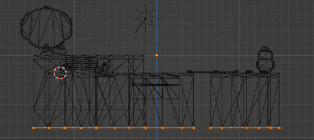
This "wrapper" is going to wrap around our terrain and cover it with a fading gradient. The wrapper is currently overlapping with the original terrain, which can cause rendering glitches, so let's enlarge it by just a tiny bit. Highlight all faces in Edit mode press Alt+S, and then you can type in a very small number like 0.01 or so to enlarge it only just a *tiny *bit, then hit Enter.

Now delete the material on this wrapper. Create a new one named "fade" and set it up like below:
For Principled BSDF, make sure "Base Color" is set to pitch black (#000000), Specular is zero, and Roughness is 1.0. For the Image Texture node (fade.png), set it to "Closest" instead of the default "Linear"
But wait, we haven't created a "fade.png" yet! You can create one pretty easily in GIMP using the Gradient tool, [with an alpha channel](https://thegimptutorials.com/how-to-add-alpha-channel/). To save you the hassle, I already prepared the fade.png for you. Right-click this image below and save it to your textures folder. Then assign it to the Image Texture node in your "fade" material.

Go into Edit mode with the 3D fade wrapper selected, highlight all faces, and press Numpad 1 to adjust the viewport so that you're facing the front of the model directly head-on. Then press U and select **Project from View (Bounds)**.  You might not notice any effect in the 3D viewport, but if you temporarily hide your terrain, you can see that the fade is, in fact, there. It'll be noticeable once you export everything to Hubs.

---

## Hubs-Specific Scene Entities

We're *almost *done! If you've managed to follow this tutorial all the way to this point, pat yourself on the back. I know it's been a lot! At this point in the tutorial, your scene should look like this in Blender's Outliner:

We're now going to add some features to the scene that are specifically for Hubs.

1. **[Navigation Mesh](__GHOST_URL__/what-is-a-nav-mesh/)** - this tells Hubs where the "walkable" surfaces are. Without it, there would be no collision and you would only be able to float around the scene like a ghost.
2. **Directional Light** and **Ambient Light** - Without these, avatars would have no light casting on them.
3. **Spawn Points** - These tell Hubs where to place your avatar when you enter the scene.
4. **Background Music** (optional) - Music is half of the experience, right?

---

## Creating a Navigation Mesh

To speed up the process of [creating a navigation mesh](__GHOST_URL__/creating-a-custom-nav-mesh-for-your-hubs-scene/), we can "cheat" by duplicating our existing terrain object. Name the duplicate object "navmesh" and delete any materials on it. Create a _new_ material named "navmesh" and assign a bright or noticeable color in the material settings "Viewport Display" subtab - like cyan or neon pink. This color will not be seen by visitors in the scene - in fact, the navigation mesh will be completely invisible in Hubs. So the color ultimately won't matter. The purpose is just to make it easier for you to identify and edit the navmesh within Blender.

💡

There's a very useful hotkey in Blender that allows you hide all other objects temporarily, so you can focus only on a single one - it's the ? (or /) key. I often toggle this on & off repeatedly when I'm working on a navmesh.

A key concept to understand about navigation meshes is that they only tell Hubs **where you can walk. **They are not a "collision mesh" like in typical game development, where every surface that you can "bump" into is included. You only want to include horizontal surfaces in the navmesh - nothing steep or vertical. We can quickly isolate the ones we already have, using a feature in Blender: Select Similar.

With the navmesh object selected in the 3D viewport, go into Edit Mode (with Tab) and select a single triangle on the ground, literally anywhere on the ground. Then in the menu, go into Select → Select Similar → Normal.
The ground face you select doesn't matter as long as it's facing up.
Blender should now be highlighting all other faces that are also facing up. Now hit Ctrl + I to invert the selection, and then Delete. The only faces remaining should be the actually walkable areas. We now have our "ground"! And just like that, you now have an almost-complete navigation mesh.

However, there are still parts of the ground that are not connected, such as the stairs and the bridges. If they're not connected in the navmesh, Hubs will not treat them as contiguous ground, and you won't be able to walk from one to the other. For the stairs in particular, what we have now is a series of floating, disconnected planes. We can replace these unusable stairs with a slope that can actually be climbed by visitors. We can do this by highlighting the edges at both ends and then pressing F to fill in the gap. See below:
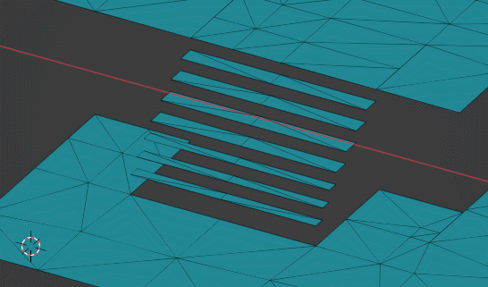Use Circle Select (C key) and Ctrl + L to quickly highlight all of the stairs
You may want to add some Loop Cuts to the slope to make it more closely resemble the shape of the original stairs. Otherwise, avatars might clip through some of the stairs.
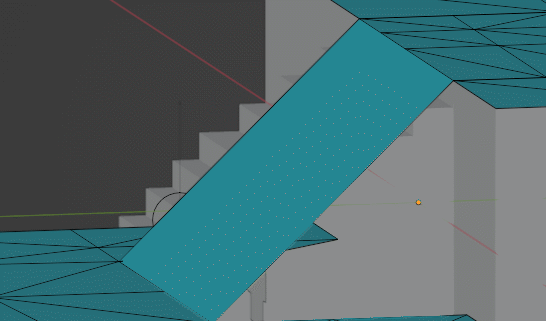You'll also want to move the bottom of the slope a bit forward, so that it's not so steep. I didn't do that in this GIF. Oops!
The other issue with our navmesh is the bridges. These are trickier to fix than the stairs, but it's doable! Use the Knife tool (K) to cut up the terrain navmesh around the bridge ends, creating a rectangular opening. Then connect the bridge with the terrain using your new cuts. Before doing all of this, you may want to hide (using the H key) the sides of the bridge to make it easier to make the necessary cuts. See two examples below of this whole process:
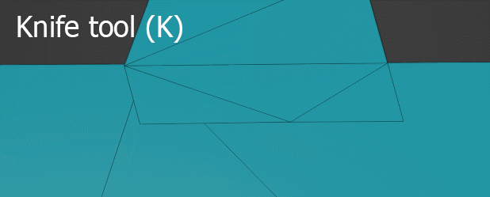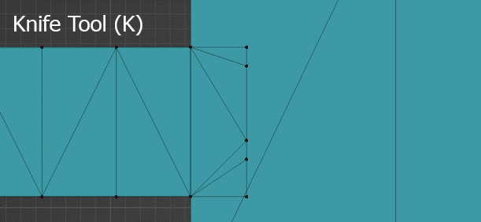You'll need to repeat this process for all three bridges, on both ends of each bridge.
There are three remaining operations to finalize the navmesh:

1. Face smoothing and 2) Triangulate: Simply highlight the entire navmesh in Edit mode, and hit Ctrl + T. Then right-click in Face selection mode (the 3 key) and choose Shade Smooth. If, after triangulating, there's any weird shading on the navmesh, you can run Limited Dissolve on it (X key) to potentially fix it. Then re-triangulate after running Limited Dissolve.

2. Fixing normals - Make sure that **Backface Culling** is turned on like in the screenshot below, and inspect the entire navmesh to make sure there are no faces anywhere that look "invisible" from above. If you see any invisible face or any spots where the shading looks weird, you probably need to flip the normals there. Select the face in Edit mode, press Alt + N, and choose Flip.
   
   One last and final step for the navmesh: We need to actually tell Hubs that it's supposed to be interpreted as a navmesh. We do that by adding a Hubs component in the Object properties. Hit the "Add Component" button and choose **Navigation Mesh**. See below:
   

---

## Light Entities for Hubs

Up until now, we've been relying on a single Blender "Sun" light. Hubs does not actually use this for lighting - only Blender does. We still need to create lights specifically for Hubs, which will be casting onto our avatars (with no effect on the terrain itself - since it's lightmapped.)

We're actually going to create two entirely new objects, which are called Empties. Hit Shift + A → Empty → Arrows. The other Empty types work as well; it's just a matter of preference. Name the two Empties, "light directional" and "light ambient".

Empties don't do anything on their own. What makes them useful is that we can add Hubs components to them in Blender, which when exported to Hubs, create special entities with certain functionality. In this case, we're going to add light components to the two Empties we just created, turning them into Hubs lights. For each Empty, select it and go into the Object properties tab, then push the "Add Component" button, and select "Directional Light" (and then repeat this but for "Ambient Light" on the other one):
Feel free to tinker with the light settings, based on your preference. For Ambient Light, I usually copy the dark color from the bottom of the skybox and then lighten it.
You won't see any effect in Blender after adding these light components. These are used by Hubs only.

Remember that the "light directional" object still needs to be rotated, just like the Sun light, to match the direction of our sun sprite in the sky. We want the light that gets cast onto avatars to be similar to the light that we had baked on our terrain.

For now, you can copy the rotation from our existing "Sun" object. Go to its Object properties, and in the Transform section,  jot down the X, Y, and Z rotations. Paste them in the Object properties for our "light directional" Empty. Later on, when you actually get your scene running in Hubs, it'll be easier to tweak the rotation further to make it more accurate.

Let's keep our Hubs lights organized to make sure they're included in our final export. Organize your scene like below, noting the new "hubs" subcollection at the bottom:
Take out the "lights" subcollection (containing our original Sun light) out of the "export" collection. From here on out, we only want things actually used by Hubs in our "export" collection. Create a "hubs" subcollection inside "export", as we will be putting all of our Empties in here.
Doesn't it feel good to stay organized? It'll pay off at export time!

---

## Placing Your Spawn Points

Just like with the lights, create another new Empty object with Shift + A. Name the new object "spawn point" and move it to the "hubs" subcollection. Now go into the Object properties and add a new Hubs component, like so:
Add a "**Waypoint**" component, with "_Use as Spawn Point_" and "_Snap to Navmesh_" checkboxes both enabled.
Position this Empty in the main area where you want your players to spawn. It can be just *slightly *above the ground, but not too high up. Duplicate the Empty around 4-8 times, then position the duplicates around the scene. It's good practice to have multiple spawn points to prevent avatars from spawning inside of each other.
When you add the "Waypoint" Hubs component to an Empty, the Hubs Blender addon will actually change the appearance of the Empty to show a cute little Hubs robot! 🤖💙

---

## Adding Looping Background Music

This step is optional, but for retro scenes, it can be the finishing touch that really stirs up the strongest feelings of nostalgia in visitors! Visitors will often hear the music as soon as the room loads, but before they actually enter the room as a named user, so it's a great way to immediately get people's attention and entice them to come into the room.

💡

You can find chiptune music with a public domain license at [ModArchive](https://modarchive.org/index.php?request=view_by_license&query=publicdomain). These come in special chiptune formats (for example, .mod and .xm) that won't work in Hubs. However, you can convert them to MP3 with tools found around the web.

To save you time, I've grabbed one already for you (in the public domain) - [Dream Candy](https://modarchive.org/index.php?request=view_by_moduleid&query=178565) by Drozerix - and converted it to MP3. Download below:

[

Dream Candy by Drozerix - MP3

bgm_dreamcandy_drozerix.mp3

3 MB

.a{fill:none;stroke:currentColor;stroke-linecap:round;stroke-linejoin:round;stroke-width:1.5px;}download-circle
](**GHOST_URL**/content/files/2022/12/bgm_dreamcandy_drozerix-1.mp3)

💡

Remember that Mozilla Hubs is a web-based platform, which means everything in our scene has to be downloaded by the visitor's browser. We want our scene to be friendly to anyone on slower internet connections, and one way to do that is by converting the MP3 from stereo to mono, in an app like [Audacity](https://www.audacityteam.org/). This is totally optional. However, if you have a large music file, converting to mono can often cut the file size in half. The MP3 I've provided above is already provided in mono for you.

Create yet _another_ Empty object, name it "bgm", and move it to the "hubs" subcollection. Then go into the Object properties on the right side of Blender, with the Empty still selected.

There is more than one Hubs component that can get you background music, but for this tutorial, we're going to be using the Audio component. This creates a player inside the 3D scene with a pause button, so if people want to stop the music (ie. so they can voice chat instead), they still can.

Position the Empty "bgm" somewhere accessible, preferably at eye level (use Walk Navigation mode, Shift + ~ to test that). Add a "Audio" Hubs component, as shown below, replacing the "Audio URL" with your own preferred MP3 URL:
Enable "Override Audio Settings" and set the Gain to something low, between 0.2 to 0.4. When you have music on autoplay, you don't want to accidentally blast visitor's speakers with something loud! You can always increase/decrease the Gain later on as needed, after you test it in Hubs.Preview of how your audio player will look in Hubs. It won't be playable in Blender itself..

---

## Exporting to Hubs

The moment we've been waiting for. We're finally ready to export everything into Hubs!

Go into Blender's Outliner on the top right, right-click our "export" collection, and choose "Select Objects". This will highlight only the objects we want to export to Hubs. Now in the top left menu of Blender, go to File → **Export as GLTF 2.0.**

A file browser window will open up. Go into the "export" folder we created in the very beginning. Then modify the export settings on the right sidebar like below, and press the "Export glTF 2.0" button on the lower right of the window.
You can (optionally) replace "YOUR NAME HERE" with your name, social media handle, email address, etc. as a way to credit yourself in the scene metadata.
Go to Mozilla Hubs' [Spoke](https://hubs.mozilla.com/spoke) page and create an account if you have not yet already. After logging in, press "Get Started," and then press the "New Project" button.

Then in the top right, press the button, "**Import from Blender**."  Enter your scene's details on the next page. You'll need to include a thumbnail. You can quickly render one in Blender by temporarily disabling the navmesh and "hubs" subcollection.

Hit "Publish" and once it's done uploading your scene, you'll be taken back to your project list, with your new scene now added to the list. You can click on it and then click on "Open in Hubs" to test out your scene!

Congratulations, you now have your own sprite-based VR world up and running for the whole world to check out. 🎉

You can check out a live demo of the completed scene [here](https://hubs.mozilla.com/RGT3ioo/sprite-world-tutorial-demo). You can also download the completed Blender project itself, using the link below.

[

Download completed .blend file (for Blender)

Sprite World (complete).blend

4 MB

.a{fill:none;stroke:currentColor;stroke-linecap:round;stroke-linejoin:round;stroke-width:1.5px;}download-circle
](**GHOST_URL**/content/files/2022/12/Sprite-World--complete-.blend)

---

## Common Issues

The first time you test your scene, you may run into some common issues. Some of these issues are sometimes caused by using Blender versions newer than the one(s) that the Hubs addon was designed for. Let's go over a few:

> **My skybox looks upside down in Hubs.**

I ran into this issue myself while writing this tutorial! I was able to work around it by vertically flipping the skybox image in GIMP.

> **I can walk through my billboard sprites. How can I prevent that?**

This is determined by your navmesh. If you create a hole in the navmesh where the billboard sprite is, visitors will not be able to walk through it.
I used the Knife tool to cut a hole where the red NPC sprite is. This effectively tells Hubs that you can't walk there.

> **The bottom of my platforms isn't fading correctly.**

This is a consequence of using the Principled BSDF shader (for transparency) instead of the "Background" shader for our "fade" material. Unlike the Background shader, the Principled BSDF shader is still technically lit and affected by lights in the environment. You may notice a "shine" (see above) being added to the fade as you move around the scene. A possible workaround for this can be found [here](__GHOST_URL__/fading-assets-gracefully/).

> **The lighting being cast on avatars doesn't look accurate. How can I fix it?**

This will require some trial and error on your part, tweaking the two light Empties in Blender and re-exporting repeatedly. However, there is a hotkey in Hubs that helps you see what the lighting looks like on your avatar. Press the "i" key while in Hubs, and then press the little 💡 icon at the bottom.

---

Should you encounter any other issues, you can always ask for help in the official [Mozilla Hubs](https://discord.com/invite/sBMqSjCndj) Discord. ✌
